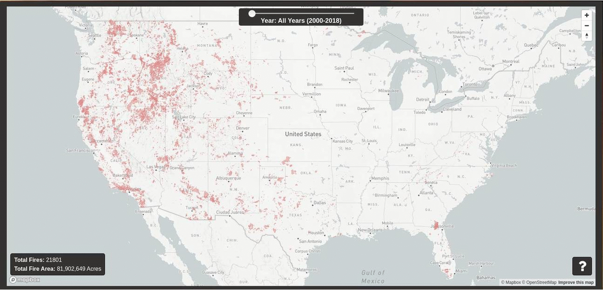

# US-Millenium-Fire-Map

Live Link: https://stickmanbob.github.io/US-Millenium-Fire-Map/

Ever since the destructive Camp fire of 2018 in Paradise, CA, wildland fires have been in the spotlight of public interest in a way they never have before. Where in the US do these fires occur the most? And how has fire changed throughout the new millenium? 
As we enter what many believe to be a new age of wildland fire, with fires getting larger and more intense than ever, it will be important to be able to visualize and analyze fire data to monitor changing trends and predict where fires will occur next.



## About

This visualization displays an interactive map of all major wildland fires recorded by the National Interagency Fire Center from the year 2000 until 2018 (complete data is not yet availible for 2019). The map and fires are displayed via the Mapbox API and a custom vector tileset made using QGis and [this dataset](https://data-nifc.opendata.arcgis.com/datasets/us-hist-fire-perimtrs-2000-2018-dd83) from NIFC. Fires can be displayed by year using the slider, or viewed all at once. Fires can be clicked on to display more information about them, including the incident code, year, and acreage. 

## Implementation
The map is displayed using the Mapbox API, with the fires drawn on top using a custom vector tileset.
Orginally the entire dataset would have been much too large to serve to the user at once, let alone display as a layer. In order to solve this I manually trimmed the dataset using QGis to remove all Alaskan wildfires (out of the scope of this project) as well as any unnecessary feature data that came with each fire (mostly foreign keys to other databases). Afterwards I exported the modified data to a geoJSON file and used tippecanoe (a Mapbox utility) to convert it into a vector tile layer, which was then uploaded to Mapbox's file hosting. While the new tileset is extremely compact and efficient, it does not allow for querying the entire dataset at once to display aggregate data (such as the total number of fires or acres burned). As a result, a dual data system was used to display both the individual fires as well as track aggregate data:

``` javascript
// Import the fire data
    var fireData = require("../assets/fire_data.json");

// Update info box using fire data

    function updateInfoBox(year = undefined) {
        
        let data;

        if (year === undefined){
            data = fireData.features;
        } else{
            data = fireData.features.filter(feature => feature.properties.fireyear === year);
        }

        let acres = 0;

        data.forEach(datum => acres += Number.parseInt(datum.properties.gisacres));

        let totalFires = data.length;

        let acresBox = document.getElementById("fire-area");

        let firesBox = document.getElementById("total-fires")

        acresBox.innerHTML = acres.toLocaleString();
        firesBox.innerHTML = totalFires; 

    }

// Filter fires when the slider is moved
// The leftmost position is for year "1999", which shows all fires (No actual data for 1999)
    yearSlider.oninput = function () {
        if (this.value === "1999") {
            sliderPos.innerHTML = "All Years (2000-2018)";
            map.setFilter('fire-data', null);
            
            updateInfoBox();
        } else {
            sliderPos.innerHTML = this.value;
            map.setFilter('fire-data', ['==', ['number', ['get', 'fireyear']], Number.parseInt(this.value)]);
            updateInfoBox(Number.parseInt(this.value));
        }

    }
```
As you can see, a local .json file was created to store all non-geometry related fire data that could then be queried to update the info box each time the year slider is moved. At the same time, a filter is applied to the vector tileset to only display fires from that year. 

